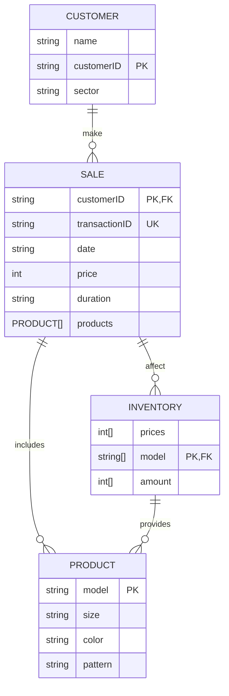

The customer makes a purchase
Leading into the product amount and type
Which leads into a sale that has specific information regarding the sale
All of which stems from the inventory amount on hand.
